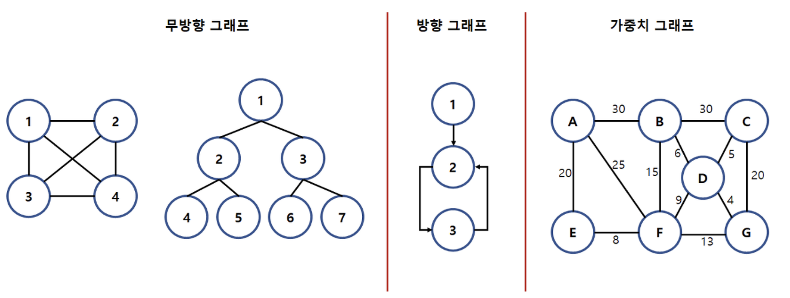
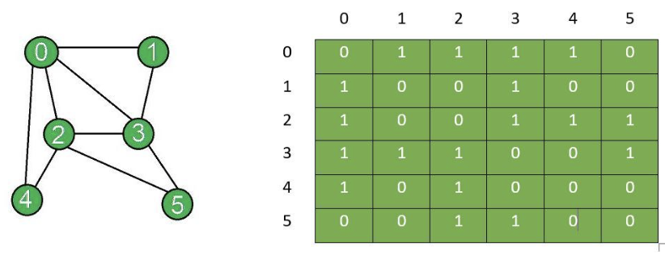
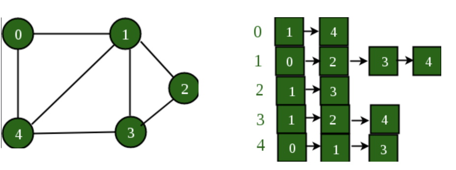

### TL;DR

- 그래프란 `정점(노드)`와 `간선(엣지`)로 이루어진 자료구조로 정점 간의 관계를 나타내는 자료구조다.
  - 구현 : 인접 행렬과 인접 리스트
- 그래프 탐색 : 하나의 정점으로부터 차례로 모든 정점들을 한 번씩 방문하기
  - 너비 우선 탐색 BFS
  - 깊이 우선 탐색 DFS
- 그래프 최단 경로
  - 다익스트라 Dijkstra
  - 플로드 와샬 Floyd-Washall 
  - 밸만 포드 Bellman-Ford
- 유니온 파인드 : 서로소 부분 집합들로 나누어진 원소들의 데이터를 처리하기 위한 **자료구조**. `union`과 `find` 2개의 연산으로 조작
- 최소 스패닝 트리 : 그래프의 모든 정점이 사이클 없이 연결된 간선 합이 최소인 스패닝 트리
  - 크루스칼과 프림 알고리즘으로 구현할 수 있다.

<br />

<br />

# 그래프 Graph

그래프는 `정점(노드)`와 `간선(엣지`)로 이루어진 자료구조로 정점 간의 관계를 나타내는 자료구조다. 트리는 그래프의 일종이다.

|           | 그래프                                           | 트리                        |
| --------- | ------------------------------------------------ | --------------------------- |
| 방향성    | 방향 그래프, 무방향 그래프                       | 방향 그래프                 |
| 사이클    | 사이클 가능. 순환 그래프, 비순환그래프 모두 가능 | 사이클 불가능. 비순환그래프 |
| 루트노드  | 루트노드 개념이 없음                             | 한 개의 루트 노드만 존재.   |
| 부모-자식 | 부모-자식 개념 없음                              | 1개의 부모 노드(루트 제외)  |
| 모델      | 네트워크 모델                                    | 계층 모델                   |
| 간선 수   | 자유                                             | N-1개                       |

<br />

#### ✅ 그래프 용어

- **정점(Vertex)** : 노드(node), 데이터가 저장되는 곳
- **간선(Edge)** : 정점간의 관계
- **인접 정점(Adjacent Vertex)** : 간선에 의해 연결된 정점
- **차수(Degree)** : 무방향 그래프에서 하나의 정점에 인접한 정점 수
- **진출 차수(Out Degree)** : 방향 그래프에서 한 정점에 외부로 향하는 간선의 수
- **진입 차수(In Degree)** : 방향 그래프에서 외부 정점에서 들어오는 간선의 수
- **단순 경로(Simple Path)** : 경로 중 반복되는 정점이 없는 경우
- **경로 길이(Path Length)** : 경로를 구성하는데 사용된 간선의 수
- **루프(Loop)** : 그래프의 한 노드에서 자기 자식으로 이어지는 간선이 있을 때 그 간선을 루프라 함.

<br />

#### ✅ 그래프 종류



- 무방향 그래프 (Non-Directed Graph) : 두 정점을 연결하는 간선에 방향이 없는 그래프
- 방향 그래프 (Directed Graph) : 두 정점을 연결하는 간선에 방향이 존재하는 그래프. 간선의 방향으로 만 이동 가능
- 가중치 그래프 (Weighted Graph) : 두 정점을 이동할 때 비용이 드는 그래프

<br />

<br />

### ✅ 그래프 구현

인접 행렬은 구현이 간단하고 조회에 O(1)의 시간 복잡도를 갖지만, sparse 한 경우 공간 낭비가 많다. 인접 리스트는 공간의 낭비가 없지만 연결 정보를 탐색할 때 O(N)의 시간 복잡도를 갖는다.

<br />

#### 1. 인접 행렬



그래프를 2차원 배열로 표현한다. 두 노드가 간선을 가지면 1 아니면 0으로 표시한다. (만약 간선에 가중치가 있다면 1대신 가중치 값을 직접 넣어준다. ) 

- 장점 : 구현이 간단함, 조회 시간복잡도 $O(1)$
- 단점 : 무조건 2차원 배열이 필요해 sparse 한 경우 메모리 낭비가 있다.

=> Dense Graph 표현할 때 더 적합하다.

<br />

#### 2. 인접 리스트



그래프를 연결리스트로 구현한다. 각 정점별로 인접리스트를 가지고 간선의 정보를 저장한다.

- 장점 : 필요한 만큼만 저장해 메모리 낭비가 적다. 
- 단점 : 두 정점이 간선을 갖는지 확인하기 위한 조회 시간복잡도 $O(N)$

=> Sparse Graph 표현할 때 더 적합하다. 

<br /><br />

## 1️⃣ 그래프 탐색

그래프 탐색이란 하나의 정점으로부터 차례로 모든 정점들을 한 번씩 방문하는 것이다.

|      | BFS                                                          | DFS                                                          |
| ---- | ------------------------------------------------------------ | ------------------------------------------------------------ |
| 장점 | ✔️ 찾아야 하는 노드가 얕을 때 빨리 탐색이 가능하다.<br />✔️ 답이 되는 경로가 여러 개인 경우에도 항상 최적해를 찾음을 보장한다. | ✔️ 찾아야 하는 노드가 깊이 있을 때 빨리 탐색이 가능하다.<br />✔️ 스택에 백트래킹 해야하는 노드만 저장해주면 돼서 BFS에 비해 공간을 적게 사용한다. |
| 단점 | 큐에 다음에 탐색할 노드를 계속 저장하기 때문에 더 큰 저장 공간이 필요하다. | 답이 아닌 깊은 경로에 빠질 수 있고, 찾은 해가 최단 경로라는 보장이 없다. |

<br />

### 1. 너비 우선 탐색 BFS

현재 정점과 연결된 정점들에 대해 우선적으로 넓게 탐색하는 방법. `큐`를 이용하여 구현하며, 현재 위치에서 갈 수 있는 것들을 모두 `큐`에 넣는 방식으로 구현한다.

- 시간 복잡도 ($V$: 정점의 개수, $E$ : 간선의 개수)
  - 인접 행렬 : $O(V^2)$<br />
  - 인접 리스트 : $O(V+E)$

<br />

```python
def bfs(graph, start):
    visited = []
    queue = [start]

    while queue:
        n = queue.pop(0)
        if n not in visited:
            visited.append(n)
            queue += graph[n] - set(visited)
    return visited
```

<br />

- 활용 예시
  - 그래프 내 사이클 확인
  - 두 정점 사이의 Path 찾기
  - 하나의 해를 가진 미로 탈출과 같은 퍼즐 풀기
  - 웹 크롤러

<br />

### 2. 깊이 우선 탐색 DFS

현재 정점에서 갈 수 있는 만큼 최대한 깊이 가고, 더 갈 곳이 없다면 이전 정점으로 돌아가는 방식이다. `스택`을 이용하거나, `재귀호출`을 통해 구현한다. 여기서 한 노드에서 제일 마지막까지 탐색을 마치고 다시 돌아오는 과정을 `백트래킹`이라고 한다.

- 시간 복잡도 ($V$: 정점의 개수, $E$ : 간선의 개수)

  - 인접 행렬 : $O(V^2)$<br />

  - 인접 리스트 : $O(V+E)$

  <br />

```python
def dfs(graph, v, visited):
  # 현재 노드 방문 처리
  visited[v] = True
  print(v, end=' ')

  # 인접 노드들 재귀적으로 방문
  for i in graph[v]:
    if not visited[i]:
      dfs(graph, i, visited)
```

<br />

- 활용 예시
  - 최단 경로 구하기
  - 최소 스패닝 트리 구하기
  - GPS 네비게이션 시스템 : 현재 위치에서의 모든 이웃 location 찾기
  - Garbage Collection 

<br />

## 2️⃣ 최단 경로 알고리즘

그래프에서 가장 짧은 경로를 찾는 알고리즘으로 상황에 맞는 효율적인 알고리즘들이 정립되어 있다.

|      | 다익스트라                            | 플로드 와샬                                                  | 벨만 포드                                             |
| ---- | ------------------------------------- | ------------------------------------------------------------ | ----------------------------------------------------- |
| 장점 | 비교적 빠르다.<br />$O((V+E)logV)$    | ✔️ 모든 지점에서 다른 모든 지점까지의 최단 경로를 한 번에 구할 수 있다.<br />✔️ 코드가 단순하고 양/음수 값의 모든 가중치에 대해 탐색 가능 | 간선의 가중치가 음수일 때도 최단 거리를 구할 수 있다. |
| 단점 | 음의 가중치가 있을 때 사용할 수 없다. | 3중 for문으로 느리다. $O(V^3)$                               | 느리다 $O(VE)$                                        |

<br />

<br />

### 1. 다익스트라 Dijkstra 알고리즘

다익스트라는 한 정점에서 모든 정점까지의 최단 경로를 구하는 알고리즘이다. 비교적 빠르게 최단 경로 탐색 가능하다. 음의 간선이 없을 때만 동작하는데 현실 세계는 음의 간선으로 표현되지 않아 실제 GPS 소프트웨어의 기본 알고리즘으로 채택되곤 한다.

그리디 알고리즘으로 분류되며 방문하지 않은 노드 중 최단거리가 가장 짧은 노드를 선택하는 과정을 반복한다. 이 때  `힙`자료구조를 사용해 시간을 단축할 수 있다. (BFS `큐` + `최소 힙`)

- 시간 복잡도
  - 인접행렬 : $O(E+VlogV)$<br/>인접 리스트 : $O((V+E)logV)$

<br />

```python
import heapq
import sys
input = sys.stdin.readline
INF = int(1e9)

# 입력받기
n, m = map(int, input().split())	# 노드의 개수, 간선의 개수
start = int(input())							# 시작 노드 번호
distance = [INF] * (n + 1)				# 최단 거리 테이블 초기화

# 그래프 (인접 리스트)
graph = [[] for i in range(n + 1)]
for _ in range(m):
    a, b, c = map(int, input().split())
    # a번 노드에서 b번 노드로 가는 비용이 c라는 의미
    graph[a].append((b, c))

def dijkstra(start):
    q = []
    # 시작 노드로 가기 위한 최단 경로는 0으로 설정한 후 큐에 삽입
    heapq.heappush(q, (0, start))
    distance[start] = 0
    while q: 
        # 가장 최단 거리가 짧은 노드에 대한 정보 꺼내기
        dist, now = heapq.heappop(q)
        # 현재 노드가 이미 처리된 적이 있는 노드라면 무시
        if distance[now] < dist:
            continue
        # 현재 노드와 연결된 다른 인접한 노드들을 확인
        for i in graph[now]:
            cost = dist + i[1]
            # 현재 노드를 거쳐서, 다른 노드로 이동하는 거리가 더 짧은 경우
            if cost < distance[i[0]]:
                distance[i[0]] = cost
                heapq.heappush(q, (cost, i[0]))

# 다익스트라 알고리즘을 수행
dijkstra(start)
```

<br />

<br />

### 2. 플로드 와샬 Floyd-Washall 알고리즘

플로드 와샬은 모든 지점에서 다른 모든 지점까지의 최단 경로를 구하는 알고리즘이다. 코드가 단순하고 양/음수 값의 모든 가중치에 대해 탐색 가능하다. 하지만 3중 포문으로 느리다

다이나믹 프로그래밍 유형에 속한다. 그래프에서 a에서 b로 가는 최단 경로를 구할 때, 모든 다른 정점 k에 대해 a -> b와 a -> k -> b 중 최단 경로를 찾는다.

점화식 : $D_{ab} = min(D_{ab},\ D_{ak} + D_{kb})$

- 시간 복잡도 : $O(V^3)$

<br />

```python
INF = int(1e9) 

# 입력 받기
n, m = map(int, input().split())	# 노드의 개수, 간선의 개수

# 그래프 (배열) 초기화
graph = [[INF] * (n + 1) for _ in range(n + 1)]
for a in range(1, n + 1):
    graph[a][a] = 0

# 그래프 입력 받기
for _ in range(m):
    a, b, c = map(int, input().split())
    graph[a][b] = c			# a -> b 비용은 c

# 점화식에 따라 플로이드 워셜 알고리즘을 수행
for k in range(1, n + 1):
    for a in range(1, n + 1):
        for b in range(1, n + 1):
            graph[a][b] = min(graph[a][b], graph[a][k] + graph[k][b])
```

<br />

<br />

### 5) 벨만 포드 Bellman-Ford 알고리즘

한 노드에서 다른 노드까지의 최단 거리를 구하는 알고리즘으로 간선의 가중치가 음수일 때도 최단 거리를 구할 수 있다. 다만 각 정점에서 모든 간선을 확인하기 때문에 느리다.

- 시간 복잡도 : $O(VE)$

<br />

```python
import sys
input = sys.stdin.readline
INF = int(1e9)

# 입력 받기	
v, e = map(int, input().split())		# 노드의 개수, 간선의 개수
distance = [INF] * (v + 1)					# 최단 거리 테이블 초기화
# 그래프 (인접 리스트) 입력 받기
edges = []
for _ in range(e):
    a, b, c = map(int, input().split())
    edges.append((a, b, c))					# (a -> b 의 비용이 c)

def bellman_ford(start):
    distance[start] = 0							# 시작 노드 초기화
    
    # 전체 v - 1번의 라운드(round)를 반복
    for i in range(v):
        # 매 반복마다 '모든 간선'을 확인
        for j in range(e):
            cur_node, next_node, edge_cost  = edges[j]
            # 현재 간선을 거쳐서 다른 노드로 이동하는 거리가 더 짧은 경우
            if distance[cur_node] != INF and distance[next_node] > distance[cur_node] + edge_cost:
                distance[next_node] = distance[cur_node] + edge_cost
                # v번째 라운드에서도 값이 갱신된다면 음수 순환이 존재
                if i == v - 1:
                    return True

    return False
 
# 벨만 포드 알고리즘 수행
negative_cycle = bellman_ford(1)
```

<br />

<br />

<br />

## 3️⃣ 기타 그래프 이론

### 유니온 파인드 Union-Find (서로소 집합 Disjoint set)

수학에서 서로소 집합은 공통 원소가 없는 두 집합을 의미한다. `서로소 집합 자료구조`는 서로소 부분 집합들로 나누어진 원소들의 데이터를 처리하기 위한 자료구조로 `union`과 `find` 2개의 연산으로 조작한다.

- 시간복잡도 : $O(V + M(1+log_(2-M/V) V))$
  - 노드 개수가 V개이고 최대 V-1개의 union 연산과 M개의 find 연산이 가능할 때 시간복잡도
  - V = 1000, find/union 연산 100만 번일 때, 약 1,000만 번의 연산 필요

<br />

```python
# 특정 원소가 속한 집합 찾기
def find_parent(parent, x) :
	# 루트 노드가 아니라면, 루트 노드를 찾을 때까지 재귀적으로 호출
  if parent[x] != x:
    parent[x] = find_parent(parent, parent[x])
   return parent[x]

# 두 원소가 속한 집합 찾기
def union_parent(parent, a, b):
  a = find_parent(parent, a)
  b = find_parent(parent, b)
  if a < b:
    parent[b] = a
  else:
    parent[a] = b

# 노드 개수와 간선 개수 입력 받기
v, e = map(int, input().split())

# 부모 테이블을 자기 자신으로 초기화
parent = [0] * (v+1)
for i in range(1, v+1):
  parent[i] = i

# union 연산 수행
for i in range(e):
  a, b = map(int, input().split())
  union_parent(parent, a, b)
```

<br />

<br />

### 최소 신장 트리 Minimum Spanning Tree

신장 트리란 그래프 G의 모든 정점이 사이클 없이 연결된 최소 연결 부분 그래프를 의미한다. 최소 스패닝 트리는 간선 합이 최소인 스패닝 트리다. 

크루스칼과 프림 두 가지 구현 방법이 있다. sparse graph에서는 크루스칼 알고리즘이, dense graph 일 때는 프림 알고리즘이 더 효율적이다. 정점의 개수가 N개, 간선의 개수가 $N^3$ 개 정도면 Prim 알고리즘이 더 효율적이다.

<br />

#### 1) 크루스칼 Kruskal 알고리즘

그리디 알고리즘의 하나로 모든 간선에 대해 정렬을 수행한 뒤, 가장 거리가 짧은 간선부터 집합에 포함시킨다. 이때, 사이클을 발생시킬 수 있는 간선의 경우 집합에 포함시키지 않는다.

- 시간 복잡도 : $O(ElogE)$
  - 간선 개수 E

<br />

```python
# FIND 특정 원소가 속한 집합 찾기
def find_parent(parent, x):
  # 루트 노드가 아니라면 루트 노드 찾을 때까지 재귀적으로 호출
  if parent[x] != x :
    parent[x] = find_parent(parent, parent[x])
  return parent[x]

# UNION 두 원소가 속한 집합 합치기
def union_parent(parent, a, b):
  a = find_parent(parent, a)
  b = find_parent(parent, b)
  if a < b:
    parent[b] = a
  else:
    parent[a] = b
    
# 입력 받기
v, e = map(int, input().split())		# 노드 개수, 간선 개수
# 그래프 (인접 리스트)
edges = []
for _ in range(e):
  a, b, c = map(int, input().split())
  edges.append((cost, a, b))
edges.sort()		# 간선 비용순으로 정렬

# 부모 테이블 초기화
parent = [0] * (v+1)
for i in range(1, v+1):
  parent[i] = i

result = 0
# 간선 하나씩 확인하면서
for edge in edges:
  cost, a, b = edge
  # 사이클이 발생하지 않는 경우에만 집합에 포함
  if find_parent(parent, a) != find_parent(parent, b):
    union_parent(parent, a, b)
    result += cost
```

<br />

<br />

#### 2) 프림 Prim 알고리즘

프림 알고리즘은 매 순간 최선의 조건을 선택하는 그리디 알고리즘을 바탕에 둔다. 즉, 탐색 정점에 대해 연결된 인접 정점들 중 비용이 가장 적은 간선으로 연결된 정점을 선택한다.

- 시간 복잡도 : $O(E + VlogV)$

<br />

```python
import heapq
from collections import defaultdict

input = sys.stdin.readline

n, m = map(int,input().split()) 			# 노드 수, 간선 수
visited = [0] * (n+1) 								# 노드의 방문 정보
# 그래프 (인접 리스트) 입력 받기
graph = defaultdict(list)
for i in range(m): 
    u, v, weight = map(int,input().split())
    graph[u].append([weight, u, v])
    graph[v].append([weight, v, u])

# 프림 알고리즘
def prim(graph, start_node):
    visited[start_node] = 1 			# 방문 갱신
    candidate = graph[start_node] # 인접 간선 추출
    heapq.heapify(candidate) 			# 우선순위 큐 생성
    mst = [] 					# mst
    total_weight = 0  # 전체 가중치

    while candidate:
        weight, u, v = heapq.heappop(candidate)		# 가중치가 가장 적은 간선 추출
        if visited[v] == 0: 		  # 방문하지 않았다면
            visited[v] = 1 				 # 방문 갱신
            mst.append((u,v)) 		 # mst 삽입
            total_weight += weight # 전체 가중치 갱신
						
            # 다음 인접 간선 탐색
            for edge in graph[v]: 
                if visited[edge[2]] == 0:						# 방문한 노드가 아니라면, (순환 방지)
                    heapq.heappush(candidate, edge) # 우선순위 큐에 edge 삽입
    return total_weight

print(prim(graph,1))
```

<br />

<br />

# References

- [helloimscy/그래프 알고리즘](https://github.com/shinhee-rebecca/2022-cs-study/blob/44209fb47d923173a2716dcfb2801d9c27749585/Algorithm/%EA%B7%B8%EB%9E%98%ED%94%84%EC%95%8C%EA%B3%A0%EB%A6%AC%EC%A6%98.md)
- [kimdukbae/벨만-포드 알고리즘](https://velog.io/@kimdukbae/%EC%95%8C%EA%B3%A0%EB%A6%AC%EC%A6%98-%EB%B2%A8%EB%A7%8C-%ED%8F%AC%EB%93%9C-%EC%95%8C%EA%B3%A0%EB%A6%AC%EC%A6%98-Bellman-Ford-Algorithm)


#### Images

- [그래프 이미지](https://pangtrue.tistory.com/147)

- [인접행렬/인접리스트](https://www.geeksforgeeks.org/add-and-remove-edge-in-adjacency-list-representation-of-a-graph/)

  