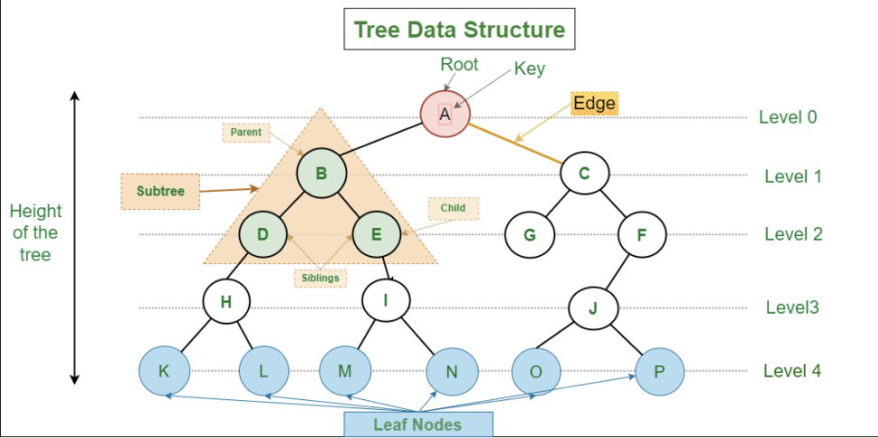
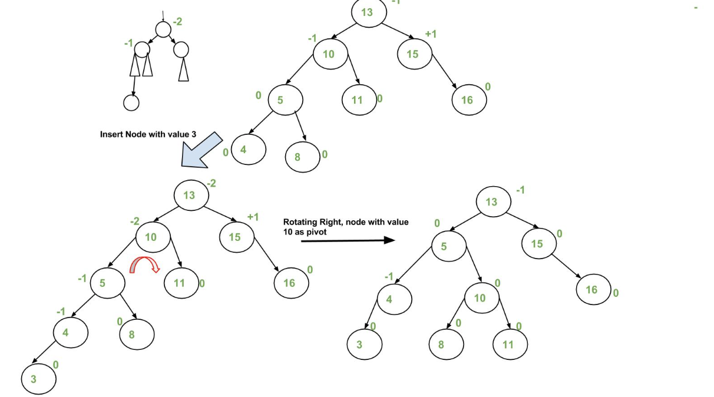
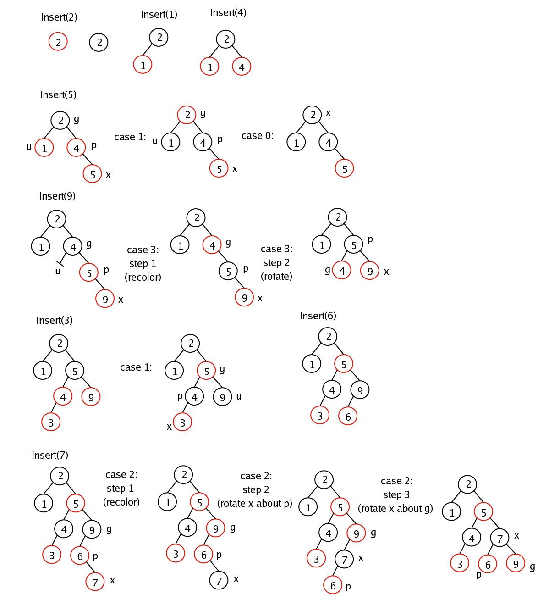
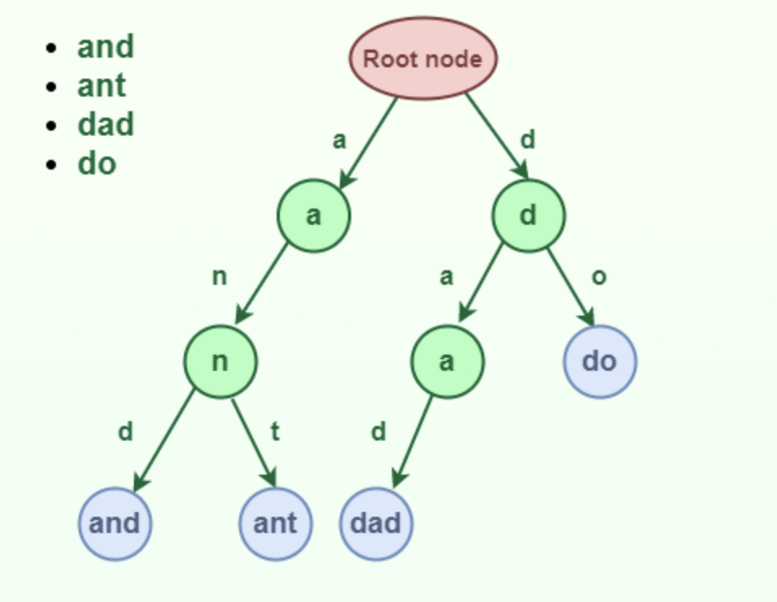
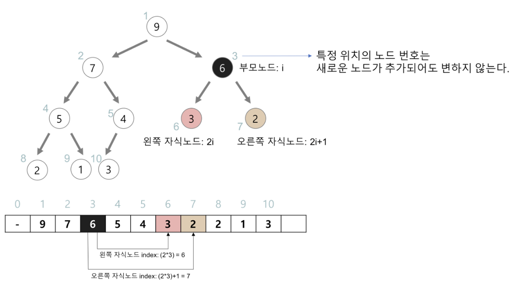
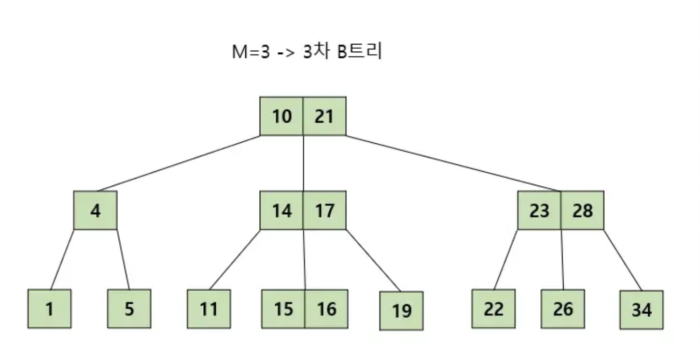
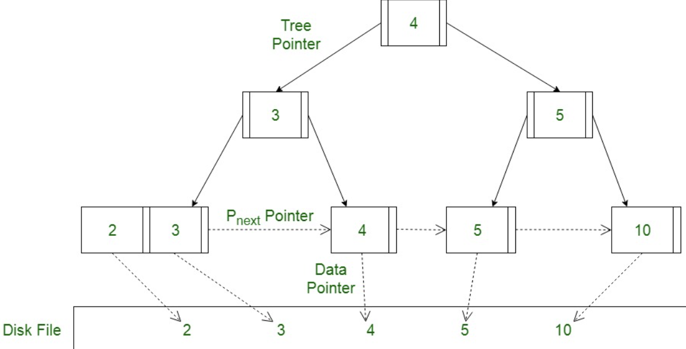

### **TL;DR**

|             | 트리                                                         | 이진 탐색 트리 BST                                           | 자가 균형 이진 탐색 트리                                     | 힙                                                           | 트라이                                                       |
| ----------- | ------------------------------------------------------------ | ------------------------------------------------------------ | ------------------------------------------------------------ | ------------------------------------------------------------ | ------------------------------------------------------------ |
| 설명        | 노드와 간선으로 이뤄진 비선형 자료구조로 계층적 관계를 표현하는 자료구조<br /> | ✔️ 정렬된 트리로 노드의 왼쪽은 항상 작은 값을, 오른 쪽은 항상 큰 값을 가진 노드들로 이루어져 있다. | 이진 트리의 균형을 유지해 높이를 가능한 낮게 유지하는 트리 <br /> | 완전 이진 트리를 기본으로 해서 여러 개의 값 중 최댓값이나 최솟값을 빠르게 찾아내기 위해 사용 | 문자열을 저장하고 효율적으로 탐색하기 위한 트리 형태의 자료구조다 |
| 특징        | 트리의 목적은 탐색                                           | ✔️ **각 노드의 키가 중복되지 않음**<br />✔️ 이진 트리의 순회 ( 중위 / 전위 / 후위) | ✔️ AVL 트리<br />✔️ Red-black 트리                             | 우선 순위 큐 구현하는데 사용                                 | 문자열 탐색 속도가 빠르지만 공간 복잡도가 높음               |
| 시간 복잡도 |                                                              | 탐색, 저장, 삭제 연산에 대해 <br />✔️ 평균 O(log N) <br />✔️ 최악의 경우 (한 쪽으로 치우친 경우) : O(N) | 탐색, 저장, 삭제 : O(log N)                                  | 삽입, 삭제 : O(log N)                                        | 길이가 M인 문제열 탐색 : O(M)                                |

<br />

---

# 트리 Tree

트리는 모양이 뒤집힌 나무와 같다고해서 붙은 이름으로  `계층적 데이터`를 나타내는 노드들의 집합이다. 트리의 가장 중요한 속성은 '루트노드를 제외한 모든 노드는 단 하나의 부모노드를 갖는다'는 것이다. 이 속성 때문에 다음과 같은 성질을 만족한다.

- 임의 노드에서 다른 노드로 가는 경로(path)는 유일하다.
- 순환하지 않는다. (cycle이 없다.)
- 모든 노드는 서로 연결되어 있다.
- 엣지를 하나 자르면 트리가 두 개로 분리된다. 
  = 트리 안에 또 다른 트리가 있는 재귀적 자료구조다.
- 엣지의 수 = 노드의 수 - 1

<br />

- ` 비선형 자료구`조다. 

> 👆 **선형 자료구조**란? 
> 자료들 간의 앞뒤 관계가 1:1인 자료구조로 배열, 링크드리스트, 스택, 큐 등이 있다. 
>
> 👆 **비선형 자료구조**란? 
> 자료들 간의 앞뒤 관계가 1:n이거나 n:n인 자료구조로 트리와 그래프가 대표적이다.

- 트리 구조를 활용하는 대표적인 예시로 컴퓨터의 폴더구조, DB의 인덱스 등이 있다. 

<br />

<br />

#### ✅ 용어 정리



- 노드 node : 트리를 구성하는 기본 요소로 데이터가 담긴다.
- 간선 edge : 노드와 노드 간 연결선
- 경로 path : 엣지로 연결된 인접한 노드들로 이뤄진 시퀀스(sequence)
- 루트 노드 (root) : 부모가 없는 최상위 노드
- 부모 노드 (parent) : 자식 노드를 가진 노드로 상대적인 개념
- 자식 노드 (children) : 부모 노드의 하위 노드로 상대적인 개념
- 형제 노드 (siblings) : 같은 부모를 가지는 노드
- 리프 노드 (leaf) : 자식 노드가 없는 노드
- 깊이 (depth) : 루트에서 해당 노드까지의 간선 수
- 높이 (height) : 어떤 노드에서 리프노드까지 가장 긴 간선의 수 

<br />

<br />

#### ✅ 구현 Representation

- 트리는 생성, 삽입, 삭제, 검색을 기본 연산으로 갖는다.

<br />

##### ✔️ Linked List

- 노드는 값과 하위 노드에 대한 포인터를 가진다.

```c++
struct Node
{
   int data;
   struct Node *left_child;
   struct Node *right_child;
};
```

<br />

##### ✔️ Array

- 주로 이진트리에서 많이 사용되는 구현 방법이다. 그 외에서는 메모리 낭비가 심해 사용하지 않는다.
- 노드 n 이 있을 때, 다음과 같은 배열 표현으로 노드의 부모 자식 관계를 쉽게 알 수 있다.
  - 부모 노드 인덱스 : n/2
  - 왼쪽 자식 인덱스 : 2n
  - 오른쪽 자식 인덱스 : 2n + 1

<br />

<br />

## 트리의 종류

### 1) 이진 탐색 트리 Binary Search Tree

이진 탐색 트리란 이진탐색(binary search)와 연결리스트(linked list)를 결합한 자료구조다. 이진탐색의 효율적인 탐색을 유지하면서도 빈번한 자료 입력과 삭제가 가능하게끔 고안됐다.

특정한 조건을 만족하는 이진트리로 특정한 조건은 다음과 같다.

> 👆 **이진트리란 ?** 각 노드의 자식 노드 수가 최대 2개인 트리를 의미한다.

- 각 노드들의 키는 중복되지 않아야 한다.
- 루트 노드의 왼쪽 서브트리는 루트 노드의 키보다 작은 키값을 갖는 노드들로 구성되어 있다.
- 루트 노드의 오른쪽 서브트리는 루트 노드의 키보다 큰 키 값을 갖는 노드들로 구성되어 있다.
- 루트 노드의 서브 트리도 이진 탐색 트리여야 한다.

<br />

- 균형 잡혀 있는 경우 삽입/삭제/탐색 모든 경우에 $O(logN)$ 시간복잡도를 갖는다.
- n개 노드가 일렬로 늘어져 높이도 n이 되는 경우, 즉 한 쪽으로 치우쳐진 경우가 최악의 경우로 링크드 리스트와 동일한 성능을 갖는다. ($O(n)$) 
  => 이러한 경우를 방지하기 위해 트리의 균형이 유지되도록 돕는 자가 균형 이진 탐색 트리를 사용할 수 있다.

<br />

#### ✔️ 이진 트리의 3가지 순회 방법


- 중위 순회 : 왼쪽 서브 트리 → 루트 → 오른쪽 서브트리의 순으로 트리 순회
- 전위 순회 : 루트 → 왼쪽 서브트리 → 오른쪽 서브트리 순으로 트리 순회
- 후위 순회 : 왼쪽 서브트리 → 오른쪽 서브트리 → 루트의 순으로 트리 순회

- 중위 순회를 하면 이진탐색트리 내 있는 모든 값을 정렬된 순서로 읽을 수 있다.

<br />

### 2) 자가 균형 이진 탐색 트리 Self-balancing Binary Search Tree

- 트리에서 노드의 삽입 혹은 삭제가 일어날 때 균형이 맞도록 조정이 일어나 어떤 노드도 왼쪽과 오른쪽 자식의 높이 차가 1 이하인 트리

> 👆**균형이 맞는 트리**란? 
> 모든 하위 트리의 높이 차가 1 이하인 트리를 의미한다.

- AVL Tree는 엄격한 균형을 이루기 때문에 Red-black 보다 더 빠른 조회를 제공한다.
- 반면 Red-black Tree는 상대적으로 느슨한 균형으로 회전이 거의 이루어지지 않아 AVL 트리보다 빠른 삽입과 삭제를 제공한다.

<br />

#### ✅ AVL Tree

- AVL 트리는 노드를 삽입 혹은 삭제할 때 `자가 균형 조정 메서드`를 호출해 트리의 균형을 유지한다.

  = 평균적으로 $O(logN)$ 의 삽입, 삭제, 검색 연산속도를 갖는다.

<br />

##### ✔️ Balance Factor(BF)



- BF는 왼쪽 서브 트리에서 오른쪽 서브트리를 뺀 값으로 -1, 0, 1 으로 이루어져 있고 이 범위를 벗어나면 균형이 깨진거다.
- 각 노드별로 BF 저장을 위해 int 저장이 필요

<br />

<br />

#### ✅ Red-Black Tree

- 트리에 노드를 삽입 혹은 삭제할 때 `특정한 규칙`을 지키도록 조정이 이루어져 트리의 균형을 유지 (red/black 이라는 추가적인 색상 bit 사용)

  = 평균적으로 $O(logN)$ 의 삽입, 삭제, 검색 연산속도를 갖는다.

<br />

##### ✔️ 특정한 조건

- 각 노드의 색은 red 또는 black 이다.
- root 노드는 black 이다.
- 모든 말단 노드(leaf node)는 black이다.
- red 노드의 자식들은 모두 black 이다. (즉, red는 연속되어 등장하지 않는다.)
- root 노드에서 시작해 자손인 leaf 노드에 이르는 모든 경로에는 동일한 개수의 black 노드가 존재한다.

<br />

##### ✔️ Restructing & Recoloring



- Insert(5) 에서, 더블 레드가 발생하고 삼촌 노드(1)가 red 라면 Recoloring
  - 부모(4)와 삼촌(1) 노드를 블랙으로 하고 부모의 부모(2)를 레드로 만든다.
  - 부모의 부모가 Root 라면 다시 black으로 변경
- Insert(9) 에서, 루트~리프까지 블랙 노드의 개수가 동일해야 하므로 Restructing (rotate)
- Insert(7) 에서, 더블 레드가 발생하고 삼촌 노드가 black 이면 Restructing (rotate)
  - 나와 부모, 부모의 부모를 오름차순으로 정렬한다.
  - 가운데 값을 부모로 만들고 나머지 둘을 자식으로 만든다.
  - 가운데 값은 블랙, 두 자식들은 레드로 만든다.

<br />

<br />

### 3) Trie 

- 문자열을 저장하고 효율적으로 탐색하기 위한 트리 형태의 자료구조
- 문자열 탐색 속도가 찾는 문자열의 길이 M에만 영향을 받는다. ($O(M)$)
- 각 노드들이 자식 노드에 대한 포인터를 저장해야하므로 공간 복잡도가 높을 수 있다. (메모리 측면에서 비효율적일 수 있다.)

<br />



<br />

영어의 경우 a-z 까지 26개의 알파벳을 저장함으로 쉽게 구축할 수 있지만 한국어는 그렇지 않다. 자음과 모음을 구분해 각 음절을 초성 + 중성 + 종성으로 구분해 저장하는 방법도 있다. 하지만 이렇게 하면 '검색 또는 자동완성'에 있어 사용하기 어렵다.

<br />

**한국어 자동완성**의 경우 자소분해를 더해 트라이 사전을 구축할 수 있다. 

자소 분해는 다음과 같이 이루어진다.

초콜릿 => ㅊ초ㅋ코콜ㄹ리릿

<br />

수 많은 단어 중 어떤 단어를 노출시킬 것인지는 키워드 기반 스코어 계산을 통해 결정된다. 스코어 계산은 검색 기능에서 필요한 대로 구현할 수 있다. 예를 들어 무신사에서 브랜드 검색 시에는 '상품을 많이 가진 순서대로' 추천해주거나, '평점이 좋은 순서대로' 추천해줄 수도 있다. 혹은 '단어의 연관성이 높은 순서대로' 추천해줄 수도 있다.

<br />

예를 들어 '초콜릿'을 입력하면

초콜릿

초콜릿박물관

초콜릿 만들기

다크 초콜릿

로이스초콜릿

등이 자동완성 된다. 

<br />

그 외에도 초성 검색 / suffix 또는 infix 검색이 필요하다면 해당 경우에 대해 Trie 자료 구조에 추가로 저장해야 한다.<br />

<br /><br /><br />

### 4) 힙 Heap

힙은 완전 이진 트리를 이용해 최댓값 혹은 최솟값을 빠르게 찾아내기 위한 자료구조이다. 부모-자식 간의 대소 관계만 성립하면 되는 느슨한 정렬상태를 유지한다.

- 삽입/삭제 시간 복잡도는 $O(logN)$

- 배열을 사용해 구현한다.
  힙은 새로운 노드를 힙의 마지막 위치에 추가한 뒤 swap 하면서 정렬하는데, 이때 배열 기반으로 구현하면 이 과정이 수월해진다.

  

  - 0번째 노드는 비워둔다. (구현의 편의를 위해)
  - N번째 노드의 왼쪽 자식 인덱스: $2n$
  - N번째 노드의 오른쪽 자식 인덱스 : $2n + 1$
  - N번째 노드의 부모 인덱스 : $n/2$

<br />

<br />

### 5) B-Tree 

B-Tree는 모든 리프 노드들이 같은 높이를 갖도록 하는 트리다. 다음과 같은 속성을 갖는다.

- 노드에는 2개 이상의 데이터(key)가 들어갈 수 있고, 항상 정렬된 상태로 저장된다.
- 특정 노드의 왼쪽 서브 트리는 특정 노드의 key보다 작은 값으로, 오른쪽 서브 트리는 큰 값으로 저장된다.
- M차 B트리일 때 노드는 M/2 ~ M개의 자식을 가질 수 있다. 
- 모든 리프 노드들이 같은 레벨에 존재한다.

<br />



- 항상 균형 트리를 유지하므로 균등한 응답 속도를 보장해 DB에서 많이 사용하는 자료구조이다.

<br />

<br />

### 6) B+Tree

B+tree는 B-tree와 비슷한데 리프 노드에만 데이터가 있고, 리프 노드가 연결 리스트 형태를 띄어 선형 검색이 가능한 트리다.

B-tree의 경우 B-Tree는 하나의 데이터를 탐색할 때는 효율적이지만 모든 데이터를 순회할 때는 트리의 모든 노드를 방문해야 해서 비효율적이다. 반면 B+tree는 리프 노드에만 데이터가 있고 연결되어 있어, 전체를 순회할 때 선형 시간 동안 탐색이 가능하다. 그렇기 때문에 DB 인덱스로는 B+트리를 많이 사용한다.





<br />

<br />

<br />

# References

- [(K-MOOC) 인공지능을 위한 알고리즘과 자료구조: 이론, 코딩, 그리고 컴퓨팅 사고](http://www.kmooc.kr/courses/course-v1:SKKUk+SKKU_46+2023_T1/course/)
- [geeksforgeeks/트리 이미지](https://www.geeksforgeeks.org/introduction-to-tree-data-structure-and-algorithm-tutorials/)

- [aguagu95/이진 트리의 균형](https://velog.io/@agugu95/%EC%9D%B4%EC%A7%84-%ED%8A%B8%EB%A6%AC%EC%9D%98-%EA%B7%A0%ED%98%95-RED-BALCKAVL)

- [shinhee-rebecca/트리](https://github.com/shinhee-rebecca/2022-cs-study/blob/main/Algorithm/%ED%8A%B8%EB%A6%AC.md)
- [ratsgo/트리와 이진트리](https://ratsgo.github.io/data%20structure&algorithm/2017/10/21/tree/)
- [cmsc341 spring 2004/ red-black tree 예시](https://redirect.cs.umbc.edu/courses/undergraduate/341/spring04/hood/notes/red_black/)
- [code-lab1/B트리 그림으로 쉽게 이해하기](https://code-lab1.tistory.com/217)


